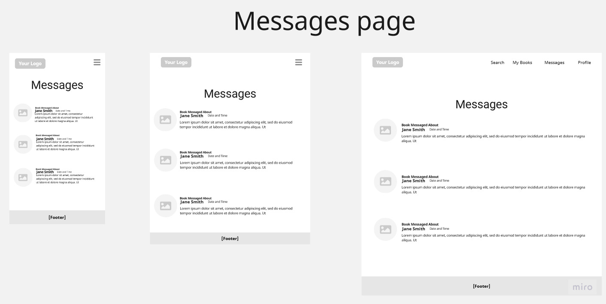
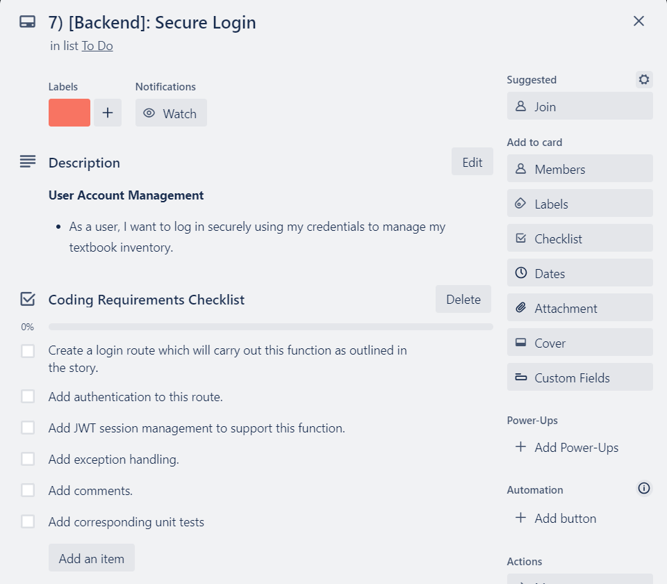

# T3A2 Full Stack Application (Part A): BookSwapU - Book Exchange Web Application

# R0. Important Links

## BookSwapU Live Frontend

https://aquamarine-kataifi-2f652b.netlify.app/

## BookSwapU Live Backend

https://bookswapu-api.onrender.com/

## BookSwapU Frontend Repository

https://github.com/rulerrobin/BookSwapU

## BookSwapU Backend Repository

https://github.com/rulerrobin/BookSwapU-api

# R1. Description of the Website

## Purpose

Our project aims to develop a comprehensive textbook exchange platform that enables students at the University of Technology, Sydney (UTS) to efficiently exchange textbooks with one another. This platform empowers students to manage their textbook needs independently, eliminating the need for university intervention. The system can be scaled for use by all universities in Sydney, across Australia, and potentially be extended to the general public. The platform will facilitate user registration, book management, inventory tracking, search capabilities, and messaging for seamless book swapping.

Some of the benefits of this approach become immediately obvious.

**Student Empowerment** - Students gain autonomy and control over their textbook needs, streamlining the exchange process.

**Cost Savings** - The platform promotes financial savings by enabling students to exchange textbooks instead of purchasing new ones.

**Sustainability and Environmental Impact** - Encourages sustainable practices by reducing the demand for new textbooks and minimizing waste.

**Enhanced Collaboration** - Facilitates collaboration and interaction between students across different universities.

## Functionality and Features

**User Registration and Authentication**

* Students can register using their university email in a standard sign-up process. Secure authentication mechanisms will ensure the privacy and security of user accounts.

* Users can create and manage their profiles, including contact information and university details.

**Book Management**

* Registered users can add, update, and delete books from their inventory.

* Book details, such as Title, Author, Condition, Owner, Edition, Year, and Status, will be stored in the system.

**Inventory Tracking**

* Each user maintains an inventory of available books they are willing to exchange.

* Inventory entries include book information like, Title, Author, Condition, Edition, Year, and Status.

**Search Functionality**

* Users can search for books based on Title and Author.

* A the search function will return a list of books and relevant information including the owner. This can be carried out on a user's own inventory.

**Listing of Desired Books and their Owners**

* When a user searches for specific books, the platform will display one or more instances of a title along with the owners username and other book details. Multiple users can be in posession of a particular title.

**Communication via Messaging**

* Users can communicate directly with other users who have the desired books for exchange.

* The platform enables messaging features to facilitate book swapping discussions.

* Users will receive messages through the system to stay informed about potential exchange opportunities.

## Target Audience

The proposed book exchange web application is targeted primarily towards university students, with the initial focus on UTS university students and later expanding to other universities in Sydney, the rest of Australia, and potentially to the general public. The target audience can be further broken down into the following categories:

* **University Students:** The primary target audience comprises university students from UTS and other universities in Sydney and Australia. These students are seeking an efficient and convenient way to exchange textbooks with their peers. They are tech-savvy and comfortable with using web applications for various purposes.

* **Textbook Owners:** Students who own textbooks they no longer need are a specific subset of the target audience. They are interested in making their textbooks available for exchange and may be looking for specific textbooks they need for their courses.

* **Textbook Seekers:** Students actively seeking specific textbooks for their courses are another key audience. They want to find textbooks they need without having to purchase them, and the application provides a platform for them to search for these books among their peers.

* **University Community:** As the application extends its reach to other universities and potentially the general public, the target audience expands to include students, faculty, and staff members from various universities, as well as individuals who are looking for a platform to exchange books.

* **Book Enthusiasts:** Individuals who have an interest in reading beyond their academic studies can also benefit from the application. They might want to explore and exchange books on various topics with other users.

The application aims to serve a diverse group of users, ranging from university students in need of textbooks for their courses to those who want to make their unused textbooks available for exchange. By catering to these different user needs, the application seeks to create a vibrant community of book exchange enthusiasts and facilitate seamless textbook swapping among students within universities and beyond.

## Technology Stack

The proposed book exchange web application (BookSwapU) will be developed using the MERN technology stack, which stands for MongoDB, Express.js, React.js, and Node.js. Each component of the stack serves a specific purpose and contributes to the overall functionality and user experience of the application.

### MongoDB (Database)

MongoDB is a NoSQL database that provides a flexible and scalable data storage solution. In the context of the book exchange application, MongoDB will be used to store information related to users, books, users' inventories, and messages. Collections for users, books, inventory items, and messages can be defined to organize and store the data efficiently. MongoDB's document-based structure allows for easy storage and retrieval of complex data structures, making it suitable for storing user profiles, book details, and inventory information.

### Express.js (Backend Framework)

Express.js is a web application framework for Node.js that simplifies the process of building server-side applications. It provides a set of tools and utilities for creating routes, handling requests and responses, and managing middleware. In the book exchange application, Express.js will be used to create APIs for user authentication, book management, search functionality, and inventory management. It will handle the communication between the frontend and the database, as well as manage the business logic of the application.

### React.js (Frontend Library)

React.js is a JavaScript library for building user interfaces. It allows for the creation of dynamic and interactive frontend components. In the book exchange application, React.js will be used to develop the user interface, including pages for user registration and login, book listing, search results, user inventory management, and messaging display. React's component-based architecture enables the development of reusable UI components that enhance the user experience.

### Node.js (Runtime Environment)

Node.js is a runtime environment that allows JavaScript to be executed on the server side. It provides a non-blocking, event-driven architecture, making it efficient for handling multiple concurrent connections. Node.js will be used as the backend runtime environment for the book exchange application. It will run the Express.js server, handle API requests, and interact with the MongoDB database.

### Additional Libraries and Tools

* **JWT (JSON Web Tokens):** JWT will be used for user authentication and authorization. It allows the application to generate and verify secure tokens for users, ensuring a secure session.

* **Bcrypt:** The BCrypt library lets you hash and salt plaintext passwords in Node.js which are then stored in the database. The frontend would also use bycrypt to encode a submitted plaintext password, and then send it on to the server.

* **ViTest, Jest and Supertest:** Vitest is the unit testing framework built on top of Vite. It is used to test componenents in React. Supertest is a Node.js library and when used together with Jest, allows developers and testers to write automated tests for routes and endpoints.

# R2. Dataflow Diagram

# R3. Application Architecture Diagram

# R4. User Stories

These user stories cover the main functionality of the Book Exchange Application. They can serve as a starting point for designing and implementing the respective features of a full stack MERN application. It is from these stories that the tasks specified in my Trello board (R6) are derived.

**User Account Management:**

* As a user, I want to create an account (sign-up) using my university email to access the textbook exchange platform.

* As a user, I want to log in securely using my credentials to manage my textbook inventory.

* As a user, I want to be able to view and update my account information (profile) like username, email and password.

**Book Management:**

* As a user, I want to view the textbooks in my inventory.

* As a user, I want filter the textbooks that I view as my inventory can get quite large.

* As a user, I want to add new textbooks to my inventory, providing details like title, author, edition, and condition.

* As a user, I want to update the details of the books in my inventory, such as condition and availability status.

* As a user, I want to remove books from my inventory that I no longer wish to exchange.

**Search and Discovery:**

* As a student, I want to search for specific textbooks by entering the title or author's name.

* As a user, I want to view a list of matching texbooks together with the identity of the user that owns the book.

* As a user, I want to see additional information about the books like the edition, year the book was published, status and condition of the textbooks in the search results.

**Book Request and Exchange Process:**

* As a user, I want to directly message other users who have the textbooks I want to exchange.

* As a user, I want to receive a message through the platform from other students with whom I have requested an exchange.

* As a user, I want to be messaged through the platform when another user wants to exchange books from my inventory.

* As a user, I want to initiate a book exchange by proposing a swap to another user with a message.

* As a user, I want to accept or reject a proposed book exchange offer from another student with a message.

* As a user, I want to be able to exhange contact details or nominate a meeting place to swap books.

These user stories outline the various features and functionalities of the proposed textbook exchange web application. Each user story addresses specific needs and requirements of students, ensuring a comprehensive and user-centric experience for all parties involved in the book exchange process.

# R5. Wireframe Diagrams

## Sitemap

# R6. Trello Board

We have settled on an Agile Kanban style approach to project management. Each card has a general heading which describes the web page that will be implemented by that block of work. Each web page is covered by two cards. One card represents all the frontend development work. The other card represents all the backend development work.

Each pair of cards contains one or more of user stories (outlined in R4) in it's description, which detail the functionality that will be implemented (frontend and backend).

Each card contains a coding requirement checklist. Each item (or task) is checked off by the developer when completed.

Please note that there isn't always a perfect mapping between user stories and Trello cards. For example, code which loads the 'Profile' page (or component) needs to be added to the 'Profile' link in the navbar component. So there is some crossover work between components. This type of work has been recorded in the cards. Collaboration between developers is required to avoid any conflicts.

The Trello board is divided into the following columns (a standard approach). All cards created will be initially placed in the Todo list and move into the "In Progress" column based on priority.

* **To Do:** Work that is yet to be commenced.
* **In Progress:** Work that is actively being undertaken.
* **Review:** Work that is completed and awaiting review. This may be a code review or it may be a requirement that is evaluated against the rubric criteria. If the item under review fails it is flagged and sent back to **"In Progress"**.
* **Completed:** Work that is completely finished and had passed the review stage.

Cards 1 and 2 have to be carried out first as this is the setup of the project infrastructure. Cards 22 to 25 are carried out in the post development phase. Cards 22 and 23 (User Acceptance Testing) are done independently of each other. All other cards can be assigned to different members of the development team and can largely be carried out independently with collaboration taking place at points where components interact.

We have calculated 14 days to complete the project. Progress will be tracked by recording a standup each day in this section of the Trello board below. A summary of the work done will be posted along with a snapshot of the Trello board.

***
Figure 1
***

***
Trello Board at the Start of Day 1
***

## Link to Trello Workspace

https://trello.com/b/EmuuACLM/bookswapu

## To Do List

***
Figure 2
***

***
Complete list of Trello Cards Representing Blocks of Work
***

## Sample Checklists

***
Figure 3
***

***
Setup Checklist for the Frontend
***

***
Figure 4
***

***
Checklist for the Login Page
***

***
Figure 5
***

***
Checklist for the Login API Route
***

***
Figure 6
***

***
Checklist for the Messaging Feature View
***

## Tracking Progress

Below are a series of screenshots of our Trello board taken at the end of each day together with a description of work done. This serves as a standup.

## Day 1 - Mon 21/8/23

The was no visible movement on the Trello board on Day 1. Our team spent this day in discussions concerning the following issues.

Explored whether we should set up git upstream so our remote branches could be synchronized with our local branches. We ran into difficulties with this approach. Being mindful of time, and the urgency to commence development, we settled on a branching strategy instead. We would create local branches for each backend and frontend feature, then push our changes to corresponding remote branches. Genuel was appointed to merge these branches into main. Phillip posted the branching strategy in Trello.

We agreed on the following work distribution based on our strengths and preferences:

Martin would develop most of the frontend using the wireframes and architecture diagrams as input.

Phillip would develop most of the backend using the wireframes and architecture diagrams as input. Phillip would update the Trello board and also update the README document in this respect.

Genuel would work on the Chat/Messaging featue of this application, which is complex, time consuming and required extra research. He would develop the frontend UI components and backend endpoint logic for this feature. He would also post regular standups in discord.

Work would be carried out concurrently after establishing a clear seperation of concerns.

Decided that collaboration would occur primarily through Discord and Trello.

Martin and Phillip would have regular meetups at the Sydney Support Hub to ensure frontend and backend interface successfully. Genuel was involved in these meetups through our Discord group chat and conference calls.

Discussed preliminary data requirements.

## Day 2 - Tue 22/8/23

**Front End:** Carried out the checklist in the frontend setup card. The following tasks were carried out:

The project repository, project directory structure was established.

A gitignore file was created to specify what project files to exclude from the repository.

The Vite tooling, development environment and server was set up and configured.

All project dependencies were installed and correctly configured.

**Back End:** Carried out the checklist in the corresponding backend setup card. The following tasks were carried out:

Genuel established and took ownership of the backend project repository.

A corresponding .gitignore file was created to specify what project files to exclude from the repository.

The backend directory structure was established in line with Express MVC standards.

All important dependencies were installed like 'dotenv', 'mongoose', 'jest' and 'supertest'.

Phillip created a script to connect to and seed the mongo database. When run the script (seed.js) created collections for users, books, user_inventory and messages.

Genuel spent time researching the socket.io package.

Both cards were promptly moved to the Review column and then the Complete column.

***
Figure 7
***

***
Trello Board at the End of Day 2
***

## Day 3 - Wed 23/8/23

Continued research and experimentation with chat functions and socket.io API.

Time was spent working out how to integrate the socket.io package into the frontend and backend.

Work commenced on login and registration both frontend and backend. Since this is a requirement for the chat feature priority was given to it by Phillip and Genuel. Extensive upfront development was carried out by both, with Phillip creating an initial version and Genuel adding support for paswword encryption and web token generation.

Martin commenced work on the navigation, hero and footer bars.

Martin commenced work on the introductory home page, and the login and registration pages.

At the end of Day 3 Task 2 was under review and Task 3 was marked as completed.

***
Figure 8
***

***
Trello Board at the End of Day 3
***

## Day 4 - Thu 24/8/23

Finished the UI for login.

Completed an endpoint for updating books.

Setup models and schemas for user, messages and chat.

Refactored folder structures for front and backends.

Work in progress: Search functions and routes for authentication and chat.

Genuel learned more about props, state, and Chakraui.

At the end of Day 4 Task 2 was marked as complete.

***
Figure 8
***

***
Trello Board at the End of Day 4
***

## Day 5 - Fri 25/8/23

Backend user authentication, login and register (Sign Up) complete.

Frontend signup and login functionality are complete.

Created middleware for processing exceptions. This removes the need for try-catch statements. Exceptions from calls to third party libraries and user generated exceptions are handled by the same middleware in conjunction with asynchandher function.

Created middleware to process exceptions generated by incorrectly specified URI's (endpoints).

Had an issue with placement of middleware in the main app.js script. The 2 error handlers weren't working. This was resolved by putting it at the end of app.js.

Tasks 4, 6 and 7 have been moved to the review stage.

***
Figure 9
***

***
Trello Board at the End of Day 5
***

## Day 6 - Sat 26/8/23

Task 5 Backend Signup has now been moved to Review.

Tasks 9, 12 and 14 have been completed and are now under Review.

Tasks 1, 2, 4, 6 an 7 have been successfully completed.

***
Figure 10
***

***
Trello Board at the End of Day 6
***

## Day 7 - Sun 27/8/23

Tasks 8 and 11 were in progress on this day.

Tasks 3 and 10 were placed under review.

Tasks 5, 9, 12 and 14 were completed successfully.

***
Figure 11
***

***
Trello Board at the End of Day 7
***

## Day 8 - Mon 28/8/23

Martin completed frontend sign in and register MVP. Changed how searches are processed as json request and response structures have changed. The Sign Up button in home page now links to the register page.

Finished the MVP for chat functionality. Change book update to fetch from the backend. It updates fine now.

Usehistory vs Usenavigate. The lesson here is to always check imports, as this caused us some headaches.

At the end of Day 8 Task 11 was under review. Tasks 3 and 10 were completed successfully.

***
Figure 12
***

***
Trello Board at the End of Day 8
***

## Day 9 - Tue 29/8/23

Genuel commenced frontend development for Chat. Made basic API routes for retrieving chat and making a chat. 

Phillip created middleware (verifyToken) for drawing the user id out from a web token. This is used to restrict all endpoints to the currently logged in user. 

Removed any superfluous endpoints which existed for debugging purposes. Refined endpoints that were retained for frontend use. Reduced the amount of data in the json returns to only what was actually required for the frontend feature.

Removed all try catch statements so that all error handling is done by middleware for controller functions not already implementing this. Functions now do explicit "throws".

Finished Chat Page UI. Commenced Sending Messages API.

Online documentation tutorials have been especially useful as you can see what functions have been updated/deprecated.

At the end of Day 9 Tasks 13 and 15 were in progress. Task 8 was under review and Task 11 was successfully completed.

***
Figure 13
***

***
Trello Board at the End of Day 9
***

## Day 10 - Wed 30/8/23

All backend exceptions now handled by middleware.

Password no longer returned in any JSON API response. 

Setup a base URL for routers. Set up user search ui for chat, and set up a basic chat page.

Merging conflicts. Using regex in mongodb for than just the first string.

Although unit tests were been written in lockstep with the devlopment of most routes, we started heavy refactoring of these tests as they weren't running independently of the data inserted by the seeb.js script. The test scripts were modified to insert its own data for use by the test, then remove this data after all the tests were completed.

Considering moving the base URI to .env file.

Chat rendering and chat sending message APIdocumentation has proven to be essential.

At the end of Day 10 Tasks 17, 20 and 21 are in progress. Tasks 13, 15 and 16 are under review, and Task 8 has been successfully completed.

***
Figure 14
***

***
Trello Board at the End of Day 10
***

## Day 11 - Thu 31/8/23

Wrote additional unit tests and assertions as some new senarios occured to us upon reflection.

All functions on the frontend are connecting to the backend and working well.

Some tests are failing due to timeouts. Had to increase the timeouts for tests involving POST routes with db inserts that took longer than the default 5 seconds.

Added additional error handling added on the frontend. Did some refactoring work.

Moved on with home page images and profile page.

Completed the massage UI and the messaging websocket API.

Many small details created bugs that were hard to trace. Lots of moving parts and moving back and forth between frontend and backend can be quite tiring.

At the end of Day 11 Tasks 20 and 23 were in progress. Tasks 17 and 21 were under review, and Tasks 13, 15 and 16 were successfully completed.

***
Figure 15
***

***
Trello Board at the End of Day 11
***

## Day 12 - Fri 1/9/23

Through my unit testing I discovered that update profile PUT route wasn't saving new passwords in encrypted form. Fixed this error in userController.js. The pre save hook wasn’t running when updating users, so passwords were being saved as plaintext. This was fixed. 

Finished UI for messaging and also completed realtime messaging

Burned out from the amount of work completed, unsure if all requried unit tests can be completed.

Further testing and system deployment are still requried.

An optional extra being considered is to implement notifications for messaging. This would most likely require extra time.

At the end of Day 12 Tasks 22, 23 and 24 are in progress. tasks 18, 19 and 20 arfe under review. Tasks 17 and 21 have been sucessfully completed.

***
Figure 16
***

***
Trello Board at the End of Day 12
***

## Day 13 - Sat 2/9/23

Spent most of the day updating and proof reading the README documentation.

Experiencing major problems with deployment. Once these were overcome we tested the full stack application against Martins database. When parts of the frontend began to fail we realized that we were still referencing localhost.

Once the referencing issue was resolved we found that existing users could not log in. We found that existing users had passwords stored as plain text, and the backend was comparing an ecrypted password against that. The solution was to re-seed the database.

There were issues with registering new users. Web tokens were not being created, then we realized that the secret key for signing the token was not set in the .env file.

So now we have a functional MERN stack application deployed.

At the end of Day 13 Task 23 - testing for the backend is done and under review. Task 23 Frontend testing is still in progress, and Tasks 18, 19 and 20 were marked as complete.

***
Figure 17
***

***
Trello Board at the End of Day 13
***

## Day 14 - 3/9/23

Spent the day finalizing frontend unit and acceptance testing.

At the end of Day 14 Task 22 was under review and was marked as complete just prior to submission. Task 23 was marked as complete.

***
Figure 18
***

***
Trello Board at the End of Day 13
***

# Testing

## Frontend Functional and Usability Testing

For User Acceptance Testing we used a test case template for manual tests. The following test cases were carried out. The outcomes of each test case are documented below.

***
Figure 19
***

***
Register Test Case 
***

***
Figure 20
***

***
Login Test Case
***

***
Figure 21
***

***
Logout Test Case
***

***
Figure 22
***

***
No User Access Test Case
***

***
Figure 23
***

***
Message Sent And Received Test Case
***

***
Figure 24
***

***
Closing Chat Window Test Case
***

***
Figure 25
***

***
User Search Bar Empty Test Case
***

\* Please note that a copy of the manual testing spreadsheet (BookSwapU_Fontend_Testing.pdf) can be found in the /docs directory.

### Note About Using the Chat Feature

If a single user wants to test the chat feature (Messages on the Navbar), they must log in in separate windows with 2 different users credentials. This way they can answer their own posts and view the results in 2 windows simultaneously.

## Backend Unit Testing

Backend unit testing is an automated process that is carried out by moving to the same directory as the package.json file and  executing the following command:

    npm test

This runs the test scripts in the /src/tests directory of our Express project structure. These scripts are used to test the API endpoints of our application. They cover general usage as well as exception handling (error messages) and missing web tokens.

